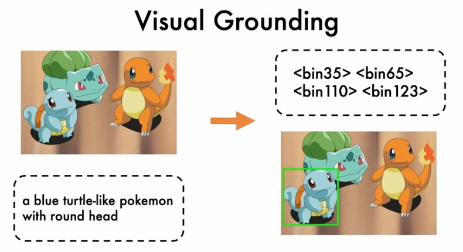

# Visual-Grounding

A project based on an unified sequence-to-sequence pretrained model called OFA to finetune the Visual Grounding task.

<p align="center">
  
</p>
<p align="center">
  <b>Figure 1:</b> Visual Grounding task
</p>

## Table of contents
* [Requirements](#requirements)
* [Setup_environment](#setup_environment)
* [Checkpoints](#checkpoints)
* [Inference](#inference)
* [VGApi](#vgapi)

## Requirements

- python 3.7.4
- pytorch 1.8.1
- torchvision 0.9.1

## Setup_environment

1. Install ofa environment by running the following command:

    ```
    pip install -r requirements.txt
    ```

2. Install fairseq by running the following command:

     ```
     cd fairseq
     pip install .
     ```

## Checkpoints
Checkpoints, which include utils and pretrained model, used in this project is stored in this google drive link: https://drive.google.com/file/d/15DdejkzFOzGUpmeqO_lyEWhfobkFzXxd/view?usp=sharing

* model/utils/BPE: byte pair encoding
* model/checkpoints/visual_grounding: pretrained visual grounding checkpoint based on ofa_base.pt

## Inference
    
    cd testVG
    python processor.py

## VGApi
    python app_dev.py

Some demo image:

<p align="center">
  
</p>
<p align="center">
  <b>Figure 2:</b> Black dress
</p>

<p align="center">
  
</p>
<p align="center">
  <b>Figure 3:</b> Black glass
</p>

<p align="center">
  
</p>
<p align="center">
  <b>Figure 4:</b> Flower pant
</p>

<p align="center">
  
</p>
<p align="center">
  <b>Figure 5:</b> Long sleeve
</p>

<p align="center">
  
</p>
<p align="center">
  <b>Figure 6:</b> Man's hat
</p>

<p align="center">
  
</p>
<p align="center">
  <b>Figure 7:</b> Woman's shirt
</p>

<p align="center">
  
</p>
<p align="center">
  <b>Figure 8:</b> Messi shirt
</p>

<p align="center">
  
</p>
<p align="center">
  <b>Figure 9:</b> Middle shirt
</p>

<p align="center">
  
</p>
<p align="center">
  <b>Figure 10:</b> Bottom right shirt
</p>